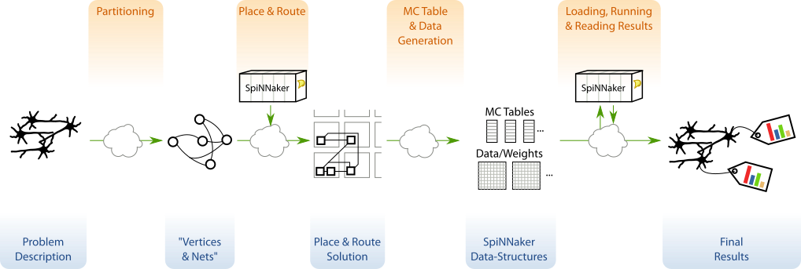
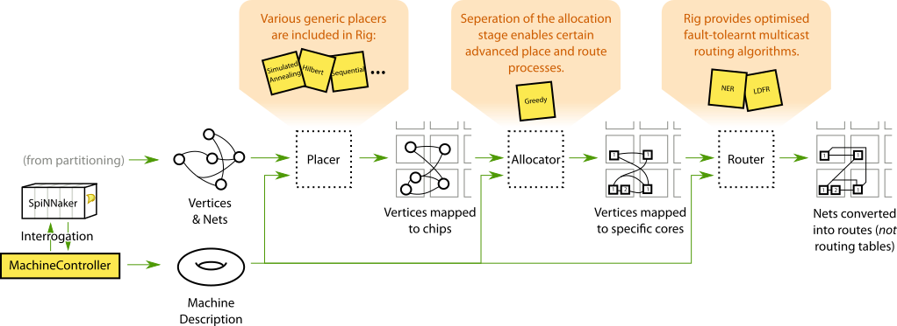
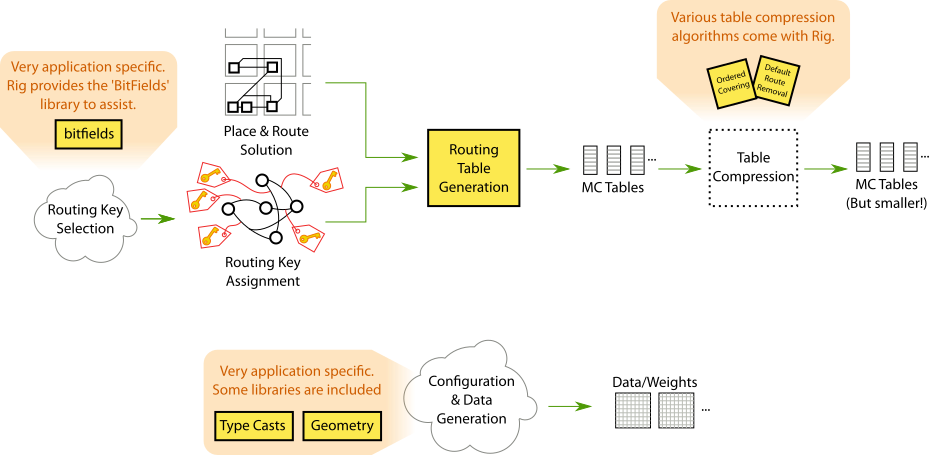
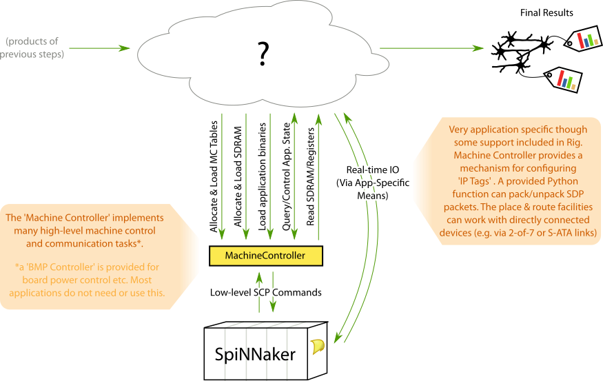

.. _tutorial-00:

00: Introduction
================

In this tutorial we'll walk through the process of building a SpiNNaker
application using the Rig library. This series of tutorials builds up from
'hello world' to eventually building full-blown digital circuit simulator.

In :ref:`part 01 <tutorial-01>` we build a simple hello world application
demonstrating how Rig can be used to load and run programs on SpiNNaker.

In parts :ref:`02 <tutorial-02>` and :ref:`03 <tutorial-03>` we get the hang of
reading and writing data into SpiNNaker.

In :ref:`part 04 <tutorial-04>` we use what we have learned to build a
proof-of-concept circuit simulator. This implementation can only simulate one
circuit and uses hand-written routing tables and manually assigns work to
SpiNNaker's processors.

In :ref:`part 05 <tutorial-05>` we rewrite our circuit simulator as if it were
a real application. We design a simple API for describing circuits and use
Rig's automatic place and route facilities to automatically map our circuit
simulations onto the SpiNNaker machine.

The digital circuit simulator we'll be building in this tutorial closely
follows the program structure used in real-world SpiNNaker applications. Though
only a very small program (under 400 lines of heavily annotated Python) our
simulator goes through almost all of the steps real neural simulation
applications do, including implementing a high-level domain-specific 'language'
for describing simulations. With luck, after completing these tutorials you will
have an understanding of how to go about building your own SpiNNaker
applications.

Before getting stuck in, we'll take a look at how a typical SpiNNaker
application is structured and highlight how Rig fits into this picture.

SpiNNaker applications and Rig
------------------------------

Though SpiNNaker is usually described as a 'computer', in practice most
applications would be more accurately described as using SpiNNaker as a
co-processor or an accelerator. As a result, most applications are written in
two parts:

SpiNNaker application kernels
    A collection of small C (or C++) programs which run on SpiNNaker's
    application cores. These programs do the 'real' work in most applications,
    for example simulating neural behaviour, recording results, or playing back
    artificial stimuli.

Host application
    A program which runs on a host computer connected to your SpiNNaker
    machine, commonly written in Python. This program handles the conversion of
    high-level user input into raw data the SpiNNaker application kernels can
    process, loads software and data onto the SpiNNaker machine and retrieves
    and processes results.

Though the SpiNNaker application kernel is responsible for most of the actual
computation, the host program is often more complex.  Rig is a library which
helps with the process of writing host applications by providing tools and
functions which simplify the task of interacting with and programming a
SpiNNaker machine.

In this tutorial we'll be building an application which follows the program
structure used by the host programs of many existing neural simulation tools
(e.g. `Nengo SpiNNaker <https://github.com/project-rig/nengo_spinnaker>`_ and
`PyNN SpiNNaker <https://github.com/project-rig/pynn_spinnaker>`_). This
program structure is illustrated in the figure below:

Most SpiNNaker applications provide a domain-specific API for describing
whatever is to be simulated. This description is then *partitioned* into a
graph of SpiNNaker-core-sized (*vertices*) which communicate with each other
(via *nets*). This first step is usually very application specific and so Rig
does not provide any functions to help.

In the place and route phase of application execution, the graph of vertices
and nets is mapped onto specific cores and routes in SpiNNaker's network. Rig
provides a number of utilities and algorithms for performing place and route
tasks for SpiNNaker applications in the :py:mod:`rig.place_and_route` module.
The figure below illustrates how Rig breaks place and route into three stages:
placement, allocation and routing. In most applications this process can be
handled automatically by a simple wrapper function but more advanced
applications can customise the process.

In the next phase of execution a typical application generates configuration
data and routing tables which will be used by SpiNNaker application kernels
(illustrated below). Though generating configuration data is highly application
specific, Rig provides a limited set of libraries such as
:py:mod:`rig.type_casts` for converting between floating and fixed point
numbers, and :py:mod:`rig.geometry` for dealing with machine geometry. Rig also
provides libraries to assist in selecting routing keys (:py:class:`rig.bitfield
<rig.bitfield.BitField>`) and generating and compressing SpiNNaker routing
tables (:py:mod:`rig.routing_table`).

In the final stage of execution (illustrated below), the SpiNNaker application
kernels are loaded onto the SpiNNaker machine along with the generated
configuration data and routing tables. Results are retrieved when
computation completes. Rig provides a
:py:class:`~rig.machine_control.MachineController` class which provides an
efficient and high-level interface for controlling and interacting with a
SpiNNaker machine. Development of custom, real-time interaction with running
SpiNNaker application kernels is also supported but remains a largely
application specific task.

.. note::

    It is important to note that the Rig library does not assume or rely on
    this particular program structure. Rig can be (and is) used in
    numerous applications with widly different structures. Examples include
    interactive use in the Python interpreter, `cabling validation software
    <https://github.com/SpiNNakerManchester/SpiNNer>`_ and `site-wide SpiNNaker
    job management and machine sharing
    <https://github.com/project-rig/spalloc_server>`_.

You will need...
----------------

Before you start this tutorial assumes you have the following set-up and
working:

1. An ARM cross-compiler. In this tutorial we presume GCC which can be
   downloaded and installed from `Launchpad
   <https://launchpad.net/gcc-arm-embedded>`_ or from the package managers of
   good Linux distributions.

2. The latest version of the 'spinnaker_tools' low-level software
   package which can be `downloaded from the SpiNNaker web pages.
   <http://apt.cs.manchester.ac.uk/projects/SpiNNaker/downloads/>`_

3. A SpiNNaker machine. Any size from a 4-chip SpiNN-2 or SpiNN-3 board upwards
   will do. To make sure everything is working correctly, make sure you can get
   the example 'hello' app supplied with 'spinnaker_tools' to compile and run
   (see the 'spinnaker_tools' README).

4. A working Python 2 or Python 3 environment with Rig :ref:`installed
   <installation>`.

Without further delay, proceed to :ref:`part 01 <tutorial-01>`.
