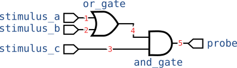
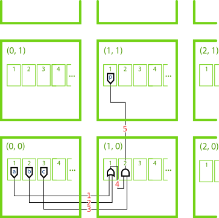
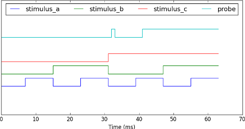

.. _tutorial-04:

04: Circuit Simulation Proof-of-Concept
=======================================

In this part of the tutorial we'll finally begin work on a real program: a
digital circuit simulator. In this stage of the tutorial we'll build the
SpiNNaker application kernels and a proof-of-concept host program to hook these
kernels together in a fixed circuit to demonstrate everything working.

The source files used in this tutorial can be downloaded below:

* Host program
    * :download:`circuit_simulator_proof.py`
* SpiNNaker kernels
    * :download:`gate.c`
    * :download:`stimulus.c`
    * :download:`probe.c`
    * :download:`Makefile`

Digital circuit simulation
--------------------------

In this tutorial we'll build a digital circuit simulator which (rather
inefficiently) simulates the behaviour of a circuit made up of simple logic
gates all wired together.

In our simulator, a logic gate is a device with one or two binary inputs and one
binary output. In the picture below, four example logic gates are given along
with truth-tables defining their behaviour.

    
Four simple 'logic gates' which each compute a simple boolean function. The
'truth tables' below enumerate the output values of each gate for every
possible input.
    
    **NOT**
        ==  ===
        in  out
        ==  ===
        0   1
        1   0
        ==  ===

    **AND, OR and XOR**
        +------+------+-----+----+-----+
        |      |      |       out      |
        | in a | in b +-----+----+-----+
        |      |      | AND | OR | XOR |
        +======+======+=====+====+=====+
        | 0    | 0    | 0   | 0  | 0   |
        +------+------+-----+----+-----+
        | 0    | 1    | 0   | 1  | 1   |
        +------+------+-----+----+-----+
        | 1    | 0    | 0   | 1  | 1   |
        +------+------+-----+----+-----+
        | 1    | 1    | 1   | 1  | 0   |
        +------+------+-----+----+-----+

Though on their own these logic gates don't do anything especially interesting
by combining them into circuits more interesting behaviour can be achieved.
Indeed, computer processors are little more than a carefully chosen collection
of logic gates!

As an example, the circuit below is known as a 'full adder' which takes three
one-bit binary numbers, 'a', 'b' and 'carry in' and adds them together to give
a two-bit result whose least significant bit is 'sum' and whose most
significant bit is 'carry out'.

For example if we set 'a' and 'carry in' to 1 and set 'b' to 0, the full-adder
circuit will produce a 0 on its 'sum' output and a 1 on its 'carry out' output.
Our inputs here are asking the full adder to compute "1 + 0 + 1" to which it
dutifully answers "10" ("2" in binary).

Try following how the input values in this example flow through the full adder
to produce the outputs in this example. For this tutorial it is not important
to understand *why* the adder circuit works but you should be able to
understand how input values flow through the circuit eventually resulting in
outputs. Working out how to build a functioning CPU out of these gates is left
as `an exercise for the easily distracted reader
<http://jhnet.co.uk/misc/STUMP_colour.pdf>`_ and is well outside the scope of
this tutorial...

Modelling a logic gate
----------------------

Our circuit simulator will use a whole SpiNNaker core for each logic gate it
simulates. Every millisecond each application core will recompute its output
and send a multicast packet to any connected gates. When a gate receives a
multicast packet indicating the value of one of its inputs it stores it to use
next time the gate's output value is computed.

Rather than writing an individual SpiNNaker application kernel for each type of
gate we want to simulate, we'll instead write a single application kernel which
is configured with a look-up table (i.e. a 'truth table') by the host to
whatever any functions we require.

``gate.c`` contains the full source listing for our gate kernel. We'll walk
through the key parts below.

.. literalinclude:: gate.c
    :language: c
    :lines: 53-68

The timer is configured to call the ``on_tick()`` function every millisecond.
This function looks-up the desired output value in a lookup table based on the
most recently received input values. The output value is then sent via a
SpiNNaker multicast packet. The function is also responsible for terminating
the simulation after a predetermined amount of time.

The ``last_input_a`` and ``last_input_b`` variables are set by the
``on_mc_packet()`` function which is called whenever a multicast packet arrives
at the core.

.. literalinclude:: gate.c
    :language: c
    :lines: 76-81

This function simply checks to see which input the incoming multicast packet is
related to by checking its key against the expected key for each of the two
inputs.

The ``config`` struct used by the two callback functions above is expected to
be written by the host and contains several fields describing the desired
behaviour of the gate being simulated.

.. literalinclude:: gate.c
    :language: c
    :lines: 12-36,38,40

The pointer to the ``config`` struct is set using the ``sark_tag_ptr()`` as
described in the previous tutorials and the callbacks setup in the ``c_main()``
function.

Stimulus and probing kernels
----------------------------

To make our simulator useful we need to be able to provide input stimulus and
record the output produced. To do this we'll create two additional SpiNNaker
application kernels: ``stimulus.c`` and ``probe.c``.

The stimulus kernel will simply output a sequence of values stored in memory,
one each millisecond. As in the gate kernel, a configuration struct is defined
which the host is expected to populate:

.. literalinclude:: stimulus.c
    :language: c
    :lines: 13-25,28

This configuration is then used by the timer interrupt to send output values
into the network:

.. literalinclude:: stimulus.c
    :language: c
    :lines: 36-52

The probe kernel takes on the reverse role: every millisecond it records into
memory the most recent input value it received. The host can later read this
data back. Once more, a configuration struct is defined which the host will
populate and to which the probe will add recorded data:

.. literalinclude:: probe.c
    :language: c
    :lines: 12-25,28

The 'recording' array is zeroed during kernel startup to save the host from
having to write the zeroes over the network:

.. literalinclude:: probe.c
    :language: c
    :lines: 74-75

The array is then written to once per millisecond with the most recently
received value:

.. literalinclude:: probe.c
    :language: c
    :lines: 39-56

As in the gate kernel, a callback on multicast packet arrival keeps track of
the most recently received input value:

.. literalinclude:: probe.c
    :language: c
    :lines: 63-66

Compiling the kernels
---------------------

A ``Makefile`` is provided which builds all three kernels when you type::

    $ make

A proof-of-concept host program
-------------------------------

To try out our new application kernels we'll now put together a
proof-of-concept host application which uses our kernels to simulate a single
circuit and hard-codes all configuration data for each application kernel. Our
proof-of-concept system will simulate the following circuit:

To do this we'll need 6 SpiNNaker cores (one for each gate, probe and
stimulus). We'll arbitrarily use the following assignment of cores:

==============  ======  ====  ============
Component       Chip    Core  Kernel
==============  ======  ====  ============
``stimulus_a``  (0, 0)  1     ``stimulus``
``stimulus_b``  (0, 0)  2     ``stimulus``
``stimulus_c``  (0, 0)  3     ``stimulus``
``or_gate``     (1, 0)  1     ``gate``
``and_gate``    (1, 0)  2     ``gate``
``probe``       (1, 1)  1     ``probe``
==============  ======  ====  ============

The five wires numbered 1 to 5 in the circuit diagram will be carried by
multicast routes whose key is the wire number.

This assignment is illustrated in the figure below:

.. note::
    
    Core 0 every SpiNNaker chip (not shown in the figure above) is always used
    by the 'monitor process' (SC&MP) which is used to facilitate control of the
    system. It cannot be used to run SpiNNaker application kernels.

We'll run our simulation for 64 ms and configure each stimulus kernel such that
each of the 8 combinations of stimulus value are held for 8 ms each to allow
time for the signals to propagate through the circuit.

The proof-of-concept host program is provided in full in
``circuit_simulator_proof.py`` and we'll walk through the key steps below. After
creating a :py:class:`~rig.machine_control.MachineController` instance and
booting the machine as usual, the first step is to allocate memory for the
configuration structs of each of the six applications using
:py:meth:`~rig.machine_control.MachineController.sdram_alloc_as_filelike`:

.. literalinclude:: circuit_simulator_proof.py
    :language: python
    :lines: 25-41

.. tip::
    
    In the code above, :py:class:`~rig.machine_control.MachineController` is
    used as a context manager. This allows a common set of arguments to be
    specified once, the chip coordinate arguments in this example, and omitted
    in subsequent calls.

Next we write the configuration structs using Python's :py:mod:`struct` module
and the `bitarray <https://pypi.python.org/pypi/bitarray/0.8.1>`_ package to
pack the desired data:

.. literalinclude:: circuit_simulator_proof.py
    :language: python
    :lines: 43-76

In order to route the multicast packets to their appropriate destinations we
must define some routing table entries on the chips we're using. We build up a
dictionary which contains a list of
:py:class:`~rig.routing_table.RoutingTableEntry` tuples for each SpiNNaker chip
where routing table entries must be added. A
:py:class:`~rig.routing_table.RoutingTableEntry` tuple corresponds directly to
a SpiNNaker routing table entry which routes packets to the supplied
:py:class:`set` of :py:class:`~rig.routing_table.Routes` when they match the
supplied key and mask value.

The routing tables described are finally loaded onto their respective chips
using the :py:meth:`~rig.machine_control.MachineController.load_routing_tables`
method of the :py:class:`~rig.machine_control.MachineController`.

.. note::
    
    Though the details of SpiNNaker's multicast router are out of the scope of
    this tutorial, in brief: we must add a routing entry wherever a packet
    enters the network, changes direction or leaves the network for a local
    core.

.. literalinclude:: circuit_simulator_proof.py
    :language: python
    :lines: 78-112

We're finally ready to load our application kernels onto their respective chips
and cores using :py:meth:`~rig.machine_control.MachineController.load_application`:

.. literalinclude:: circuit_simulator_proof.py
    :language: python
    :lines: 115-119

.. note::
    
    :py:meth:`~rig.machine_control.MachineController.load_application` uses an
    efficient flood-fill mechanism to applications onto several chips and cores
    simultaneously.

The 'Spin1 API' used to write the application kernels causes our kernels to
wait at the 'sync0' barrier once the ``spin1_start()`` function is called at
the end of ``c_main()``. We will use
:py:meth:`~rig.machine_control.MachineController.wait_for_cores_to_reach_state`
to wait for all six application kernels to reach the 'sync0' barrier:

.. literalinclude:: circuit_simulator_proof.py
    :language: python
    :lines: 123

Next we send the 'sync0' signal using
:py:meth:`~rig.machine_control.MachineController.send_signal`. This starts our
application kernels running. After 64 ms all of the applications
should terminate and we wait for them to exit using
:py:meth:`~rig.machine_control.MachineController.wait_for_cores_to_reach_state`.

.. literalinclude:: circuit_simulator_proof.py
    :language: python
    :lines: 127-129

Next we retrieve the result data recorded by the probe:

.. literalinclude:: circuit_simulator_proof.py
    :language: python
    :lines: 132-133

.. note::
    Note that the ``probe_config`` file-like object's read pointer was moved
    to the start of the ``recording`` array when the configuration data before
    it was written earlier in the host program.

The stimulus and recorded data are plotted using
:py:mod:`~matplotlib.pyplot` to produce a figure like the one below:

.. note::
    
    The recording shows a 'glitch' at time=32 which is caused by propagation
    delays in our circuit rather than a bug in our simulator. In fact,
    our simulator has accurately modelled an unintended feature of our circuit!

And there we have it: a real digital circuit simulation running on SpiNNaker!
Unfortunately, our simulator is not especially flexible. Changing the circuit
requires re-writing swathes of code and hand-generating yet more routing
tables. In the next part of the tutorial we'll make use of the automatic
place-and-route features included in the Rig library to take care of this for
us. So without further delay, let's proceed to :ref:`part 05 <tutorial-05>`!
