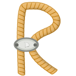

.. Rig documentation master file, created by
   sphinx-quickstart on Tue Jan 20 15:22:07 2015.
   You can adapt this file completely to your liking, but it should at least
   contain the root `toctree` directive.

Rig - libraries for SpiNNaker application support
=================================================

Rig is a set of Python and C libraries for mapping computational problems to
SpiNNaker and interacting with them.  Above all it aims to be light weight and
to present common and well-documented interfaces to all of its parts.

Rig is split into three primary groups of tools and utilities:

Execution specification
-----------------------

Allows specification of the sets of executables that are to be simulated on
SpiNNaker.  Tools exist for:

.. toctree::
        :maxdepth: 2

        bitfield_doctest
        regions

Problem mapping
---------------

.. toctree::
        :maxdepth: 2
        
        place_and_route
        machine
        routing_table
        netlist
        geometry

Execution control
-----------------

.. toctree::
        :maxdepth: 2

        control
        control_api

Indices and tables
==================

* :ref:`genindex`
* :ref:`modindex`
* :ref:`search`

